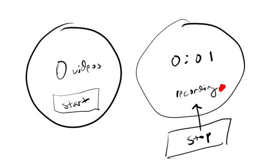

### 04/02/2024

11:51 AM

I slept in today, I worked 5, 10 hr days

So I'm pretty beat, just slowly going through this

I want to "wrap" this project up hardware wise where I can then just fly/record footage and start doing the ML stuff

11:59 AM

I'm still distracted

Today's goals:

- [ ] get basic understanding of demo code wrt:
  - how to draw something
  - how to get touch input
  - how to access imu values
- [ ] talk to RPi
  - basic is just high/low GPIO out
  - serial/i2c is more desirable
- [ ] bridge touchscreen with python

12:22 PM

I'm still distracted, dumb monke scrolling

Free yourself boy, remember what awaits you in 2 days

So when the demo runs it:

- flashes different colors
- some different drawings/font
- then shows live output of accel with "longpress" to quit interesting
- then a touch thing

I feel like I'm cheating using my ultrawide monitor to read code vs. the laptop in front of me

I'm just used to looking forward/bigger display vs. down/smaller

I say "cheating" because I want to develop from a laptop but I don't, I use a desktop

This is the "main" equivalent `esp32-s3-touch-lcd-1.28-demo.ino`

it uses integers for state handling interesting eg. `#if 1`

oh no they're just switches I guess, they're all if 1 but if 0 would be turn off

lol

https://cplusplus.com/forum/beginner/284804/

noob!

12:32 PM

the code has everything in setup

12:37 PM

man flashing this is not great

Had to restart arduino, do permission again

seems I have to do the permission every time it is connected

the `sudo chmod a+rw /dev/ttyACM0`

Probably makes sense regarding random peripherals having same path

I see the serial monitor though baud rate of 115200

1:08 PM

Distracted by life (poor)

1:20 PM

Alright what do I want to do...

1:23 PM

Here's an interface

I feel bad that this is all this UI will do... but more happens underneath eg. storing IMU values as the video records

1:36 PM

Setting up git on the laptop

2:50 PM

Back from brief break

I did realize that serial is probably easy, assuming it works like other "arduino" platforms eg. bring in the serial library and specify pins then it works... have to see

I'm thinking I may still have dedicated button pins just because

I could have separate threads and not block a primary communication line

3:03 PM

Holy f

Jacob please focus

3:06 PM

Need to do brief workout, I want to get more sculpted since I've dropped enough weight to be noticeable again, still have like 15 lbs to go
