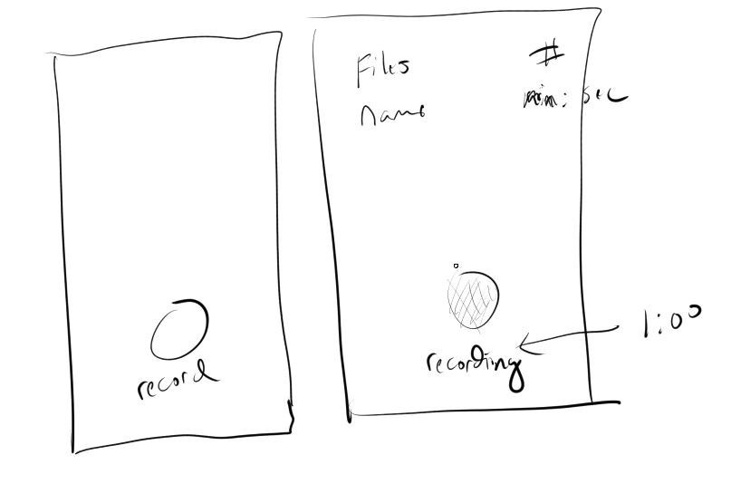
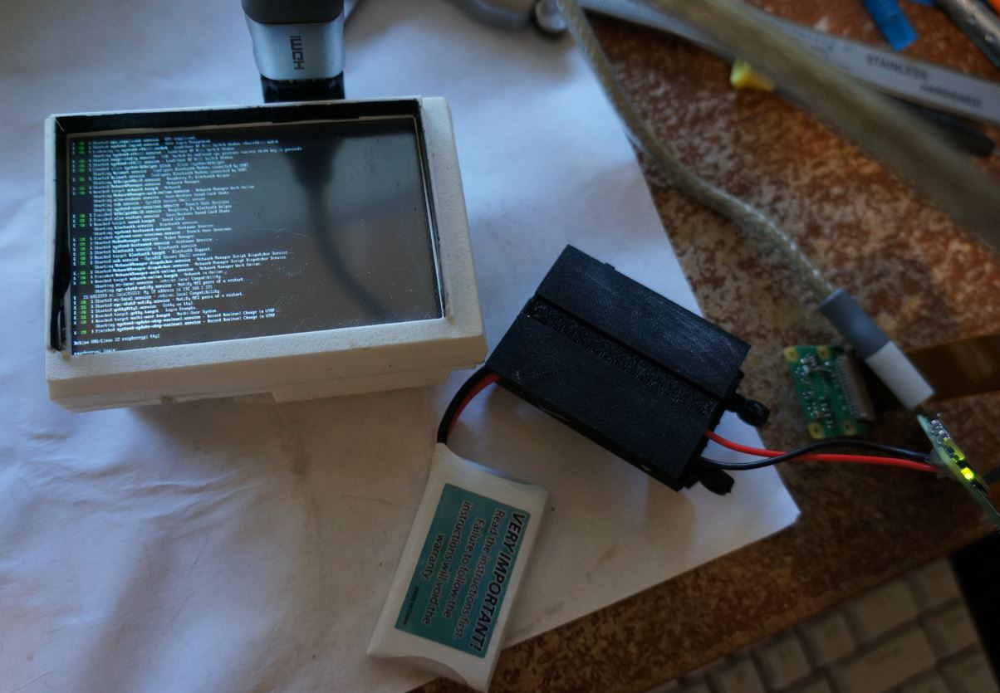

### 03/19/2024

8:41 AM

Man's been getting up, it is cold af but will warm up later

reprinting the chasis 2hrs 38mins

9:04 AM

I was thinking if the RPi AP interface hosts videos (after converting .h264 to .mp4) then they can be viewed on the web interface, that would be nice for verifying that it's all working

9:57 AM

Alright... focus mode, kornholio engaged

Gotta write that software

Got things charging, printing... getting ready to fly, I'll also take out the RPi HQ cam again with the 16mm to try it out more

10:03 AM

Trying to find the IP

Interface will be very basic like this

10:12 AM

Omg... stuck trying to get the ip address lmao, for some reason it won't show up on arp-scan

I don't have a keyboard that goes into the micro usb...

10:15 AM

Alright, stole OTG cable from pi zero 1 non-w that it uses for usb-wifi adapter

it did show up huh... just won't respond to ssh

I'm reflashing the SD card

10:25 AM

I haven't watched an rpi bootup in a bit, says "generating 391 keys" or something

10:31 AM

I don't get it, iwgetid suggests it's on the network but I can't ping anything

hopefully the board isn't damaged somehow like non-functioning wifi

10:44 AM

OMG... thank you internet

this guy fixed it

https://forums.debian.net/viewtopic.php?t=155154

the etc resolv fix with 1.1.1.1

10:47 AM

OMG this is torture, they turned the water off in my apt and I can't wash my hands! They have flux on them... yuckkkkkkk ahhhh reeeeeeee

Okay back on track now that the RPi is ssh'able

10:50 AM

Or not... huh

damn, when it restarts the file is overwritten

10:58 AM

Fuhhh why am I stuck on this man... maybe an update will fix it

11:10 AM

I got lucky I did my morning shower/teeth routine before the water was cut off

Idk how this got fixed, I tried this

https://raspberrypi.stackexchange.com/questions/38834/how-to-prevent-etc-resolv-conf-from-being-overwritten

and it's working now but the resolv.conf file looks the same...

omg... it was now it stopped wtf...

ugh... damn it

I need this AP

I don't understand man... the modular pi uses the same OS it's fine

released 3/15/2024 hmm...

I'm gonna use the one from 3-13 with balena etcher

11:18 AM

Hmm... did I goof the switch position?

Hmm... I mean if the switch is not inline with the battery then there will be continuous bleed until the BMS shuts it off... which I guess is the purpose

But what I don't understand is how does it charge the battery if it's in the off state... wtf

It clearly does... I must have drawn the wrong diagram

Yeah... so on the mpicam the switch is on the output... oof dumb

11:41 AM

Ugh... still stuck on bad wireless connection to RPi damn it

If it is hardware I can swap to another pi... solder the female header board again later

11:51 AM

yeah this chasis design is bad

I keep snapping the supports off, I was able to fix it but not good for reproduction

have to be careful removing the supports, pull/push from the sides

If you go with vertical boards the profile would be smaller, the power-related boards I mean

2 layers instead of 3

I got some super glue fumes into my eye damn from a soldering iron, dumb

11:54 AM

OMG... it still doesn't work

I'll try another OS then another pi

12:01 PM

Finally water is back on, can wash my hands (satisfied face wash meme)

Ugh... trying 12/11/2024 bookworm

12:13 PM

Okay... so I tried a new pi and it works... guess this one is bad damn

It does work but you gotta mess around with it... hmm

12:15 PM

Fuhhhh I gotta solder again damn

12:43 PM

Alright it's assembled now

Used a bread tie to keep the ribbon cable down lol that's normally kept down by a top board

12:50 PM

Damn it's assembled but I already see problems, like it swivels easily since I rotate to throw the plane, that can be a problem

Might cheat and use tape or something for now, till I add a fix for a new version

It's pretty legit though like it looks goofy but it's smaller than the ML Hat Cam

1:03 PM

Quick food break

- [ ] AP mobile controller
  - systemd (runs on boot)
  - host page/connect with phone (pretty wifi name)
  - code that does recording (start/stop)
  - bridge with frontend via websocket
  - button on page that disables AP mode (this could be optional, not for field)

1:20 PM

Can he do it?

1:24 PM

OMG it is an amazing day outside... reeeeee I gotta get out there, this has to work

720p though sucks

1:30 PM

Damn the installation of picamera2 takes a min, it's over 600MB

1:34 PM

Oh damn... I forgot how much vibration is in this thing

That could be a problem

We're commited

I'm not sure if reducing fps would help

1:38 PM

Ooh the 1080P 50FPS files are big ha

sweet... nice

1:48 PM

Hmm.... I just need a basic server

Apache would be fine

Then python runs in the backend with a socket controller

AP runs too

1:54 PM

Man I am low on time, relying on code I've written in the past and making it super ugly

2:35 PM

Okay at this point I have a working controller/python code to start/stop video recordings...

What I need to do now is do the AP startup and make sure it all works from wifi/local host

---

### 03/18/2024

8:57 AM

Alright I actually got up early since I have a couple of things to do today

8 hrs sleep vs. 10 or 12 is not bad

Gonna print the test clip that is the base of the whole plastic body

Then the camera/swivel hinge thing

9:39 AM

Back on from brief break, print is at 80%

This is probably too big of an opening

Tomorrow's gonna be amazing

9:43 AM

Dang it has way too much give and too long

The length is based on how long the Pi Zero W is, I'll push it outwards

10:10 AM

Alright my schedule got pushed back so I will have more time to work on this

I have to fly before 3PM tomorrow that's when the lift will be strongest or after that

Have to assemble it, still don't know how to use the ESP32-based display

10:32 AM

3rd print on hat clip... it's nasty freehanded curves

11:27 AM

Ugh... my dunce brain... I was in a hurry to remove the back plate of my phone and I ripped the finger print cable in half... ughhhhh I've done this before but I was just on autopilot/not careful

Gotta wait another 3-4 days for a fully functional phone

12:16 PM

I finally have a phone again... was using a flip phone for a bit

So dumb... it just fell on my laptop edge (MBP) and it broke the screen lmao

12:43 PM

I'm laying out the parts... I'm trying not to make it too wide or too tall...

The daughter board that slides into the 40-pin female header will hold the round display... it should have a case all the way around it but I'm still unsure of the wiring at this time

1:02 PM

The cable blocks the hinge mechanism... so I'm still srewing around with that

I guess I'll do a split design where the cable is not blocked by a single hinge, will use 2

1:17 PM

I bought this lemon meringue pie from walmart ugh it sucks... I gotta eat it, no waste

1:26 PM

I have to avoid eating salty food until I donate plasma so my stage 2 hypertension doesn't disqualify me

That's right baby, I'm next in line

Alright let's go I have another hour before I have to do a call

OMG please... save me from poverty

I'm just thinking about that time I messed up my knee from a bull ride and had to pay $3K in cash for an MRI since my insurance was like "nah"

I still have that debt

1:32 PM

Yeah so it will look like this, trying to give it enough room for air flow

I have to figure out what wires to use and how to power the thing... I already have some idea but I'll just leave room for that. The 2nd design will be more legit.

Today would have been a nice day if it was 25 degrees outside

Tomorrow almost hitting 70 F is nuts and convenient

The wind is not ideal... but I can deal with it

Yeah... tomorrow's wind is not great

Red is ideal tomorrow is going from western winds to north western

The thermals get picked up from the field and then carried to where I am that diagonal green field area

2:20 PM

Ugh... this is the laziest design

Unfortunately it has a lot of parts mostly due to the large components eg. step up converter/bms

The clip is printed separately just because of how complicated this thing is (lots of supports already)

2:24 PM

How long will this print... can't be as bad as 10 hrs

2 hrs that's not bad, I'll print this while I'm gone

3:40 PM

Back from call/break

Ahh man... I gotta solder the parts, though would help to have this thing printed so I can gauge the length of the wires

I have to write the code that starts off in AP mode, turn it off (so can SSH, change)

6:39 PM

Back, bandaid on my pinkey, bangage on arm

Man the print is so brittle/weak... I already broke it trying to get the support off

---

### 03/17/2024

5:00 PM

Alright early day from work loss of $35

make it count

5:41 PM

Damn I feel spent still, eyes hurt

Came up with a design and other purposes for this camera though

### 03/16/2024

7:20 PM

I did buy another v3 standard module, I have 3 now damn

I have to get the display programmable so I can modify it but unfortunately that is something I have to learn

I will focus on making a physical thing and programming later, it will be ugly but it has to work at the field on Tuesday 03/19/2024

8:07 PM

Idk why but after work (10 hr shift) I have this miserable headache I can't shake

I thought it was food, dehydration... but yeah I'm just drained man...

At best I sleep by 11:30 PM, wake up 5:55 AM so 6.5 hrs of sleep

Then work for 10 hours until 5:30 PM come how... that's almost 12 hours of being up I guess

I'm supposed to be applying to jobs but I have not since I started the modular pi cam v2 project

### 03/15/2024

10:06 PM

New project already and still in work week

I have been getting the itch to fly though with spring

All of my footage up to now has been from a ground camera, so you see this little dot flying around in the sky

This one will be POV footage
