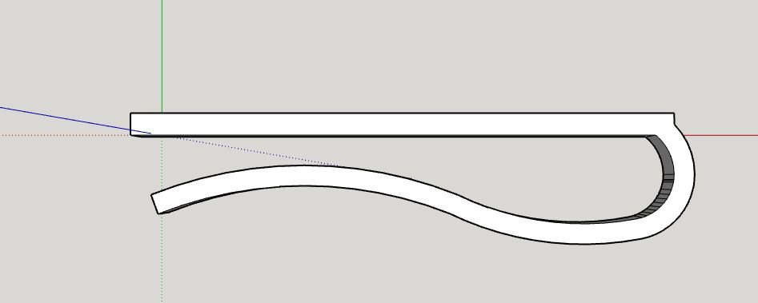
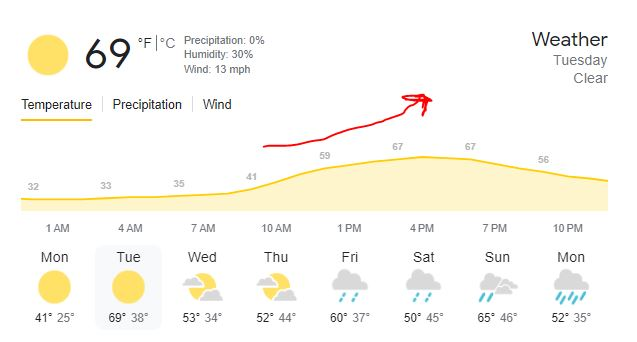
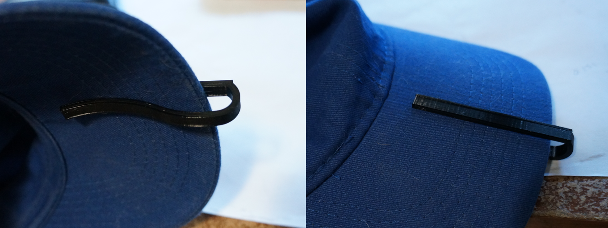
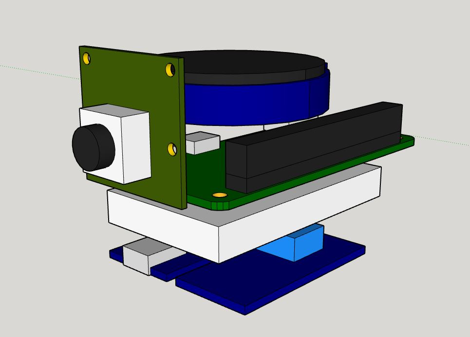
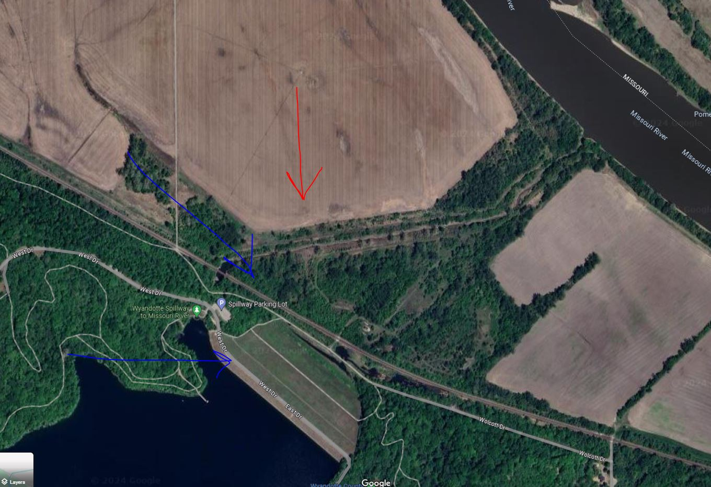
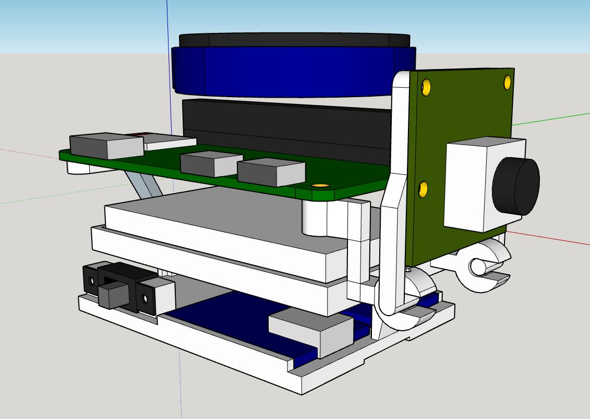
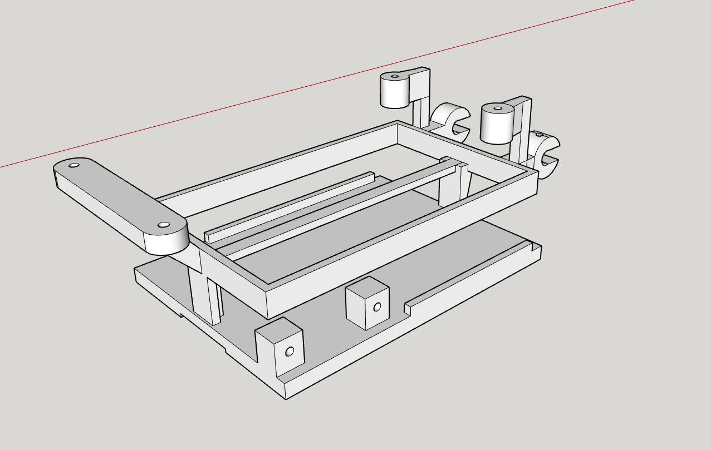

### 03/18/2024

8:57 AM

Alright I actually got up early since I have a couple of things to do today

8 hrs sleep vs. 10 or 12 is not bad

Gonna print the test clip that is the base of the whole plastic body

Then the camera/swivel hinge thing

9:39 AM

Back on from brief break, print is at 80%

This is probably too big of an opening

Tomorrow's gonna be amazing

9:43 AM

Dang it has way too much give and too long

The length is based on how long the Pi Zero W is, I'll push it outwards

10:10 AM

Alright my schedule got pushed back so I will have more time to work on this

I have to fly before 3PM tomorrow that's when the lift will be strongest or after that

Have to assemble it, still don't know how to use the ESP32-based display

10:32 AM

3rd print on hat clip... it's nasty freehanded curves

11:27 AM

Ugh... my dunce brain... I was in a hurry to remove the back plate of my phone and I ripped the finger print cable in half... ughhhhh I've done this before but I was just on autopilot/not careful

Gotta wait another 3-4 days for a fully functional phone

12:16 PM

I finally have a phone again... was using a flip phone for a bit

So dumb... it just fell on my laptop edge (MBP) and it broke the screen lmao

12:43 PM

I'm laying out the parts... I'm trying not to make it too wide or too tall...

The daughter board that slides into the 40-pin female header will hold the round display... it should have a case all the way around it but I'm still unsure of the wiring at this time

1:02 PM

The cable blocks the hinge mechanism... so I'm still srewing around with that

I guess I'll do a split design where the cable is not blocked by a single hinge, will use 2

1:17 PM

I bought this lemon meringue pie from walmart ugh it sucks... I gotta eat it, no waste

1:26 PM

I have to avoid eating salty food until I donate plasma so my stage 2 hypertension doesn't disqualify me

That's right baby, I'm next in line

Alright let's go I have another hour before I have to do a call

OMG please... save me from poverty

I'm just thinking about that time I messed up my knee from a bull ride and had to pay $3K in cash for an MRI since my insurance was like "nah"

I still have that debt

1:32 PM

Yeah so it will look like this, trying to give it enough room for air flow

I have to figure out what wires to use and how to power the thing... I already have some idea but I'll just leave room for that. The 2nd design will be more legit.

Today would have been a nice day if it was 25 degrees outside

Tomorrow almost hitting 70 F is nuts and convenient

The wind is not ideal... but I can deal with it

Yeah... tomorrow's wind is not great

Red is ideal tomorrow is going from western winds to north western

The thermals get picked up from the field and then carried to where I am that diagonal green field area

2:20 PM

Ugh... this is the laziest design

Unfortunately it has a lot of parts mostly due to the large components eg. step up converter/bms

The clip is printed separately just because of how complicated this thing is (lots of supports already)

2:24 PM

How long will this print... can't be as bad as 10 hrs

2 hrs that's not bad, I'll print this while I'm gone

3:40 PM

Back from call/break

Ahh man... I gotta solder the parts, though would help to have this thing printed so I can gauge the length of the wires

I have to write the code that starts off in AP mode, turn it off (so can SSH, change)

---

### 03/17/2024

5:00 PM

Alright early day from work loss of $35

make it count

5:41 PM

Damn I feel spent still, eyes hurt

Came up with a design and other purposes for this camera though

### 03/16/2024

7:20 PM

I did buy another v3 standard module, I have 3 now damn

I have to get the display programmable so I can modify it but unfortunately that is something I have to learn

I will focus on making a physical thing and programming later, it will be ugly but it has to work at the field on Tuesday 03/19/2024

8:07 PM

Idk why but after work (10 hr shift) I have this miserable headache I can't shake

I thought it was food, dehydration... but yeah I'm just drained man...

At best I sleep by 11:30 PM, wake up 5:55 AM so 6.5 hrs of sleep

Then work for 10 hours until 5:30 PM come how... that's almost 12 hours of being up I guess

I'm supposed to be applying to jobs but I have not since I started the modular pi cam v2 project

### 03/15/2024

10:06 PM

New project already and still in work week

I have been getting the itch to fly though with spring

All of my footage up to now has been from a ground camera, so you see this little dot flying around in the sky

This one will be POV footage
