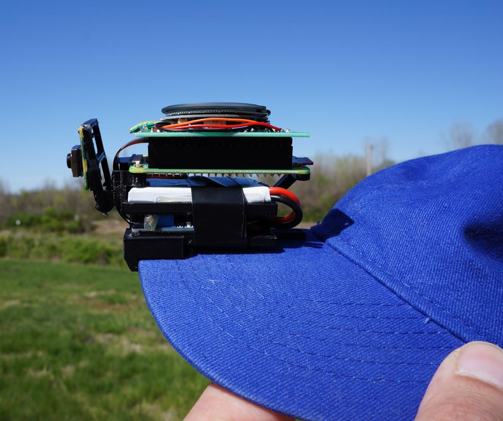

### ML Clip Cam

This is for filming an RC plane or POV recording

 

 

 

The ML is just finding the RC plane in the sky, focus is for me to learn more about training my own model.

This one is much simpler than the larger [ml hat cam](https://github.com/jdc-cunningham/ml-hat-cam) which the next phase will be a ground-based tripod that tracks the plane.

I have not used this touch screen before, this one is ESP32 based. Seems it has GPIO pins which I can use to interact with the RPi.
